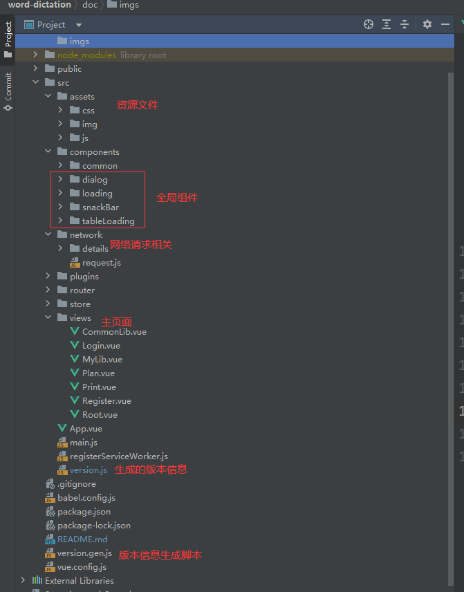
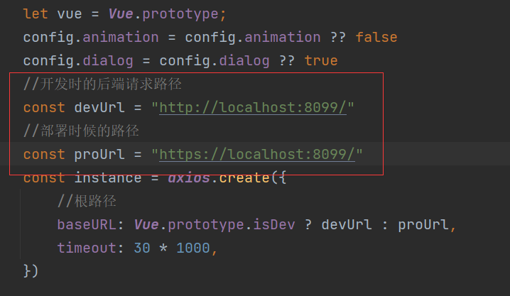
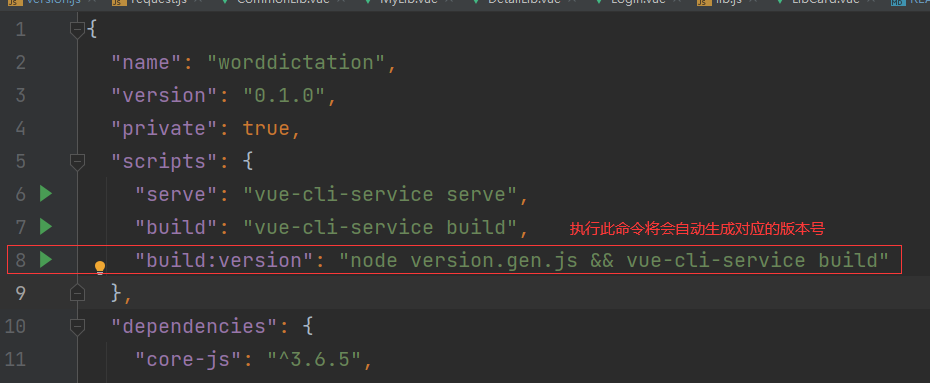
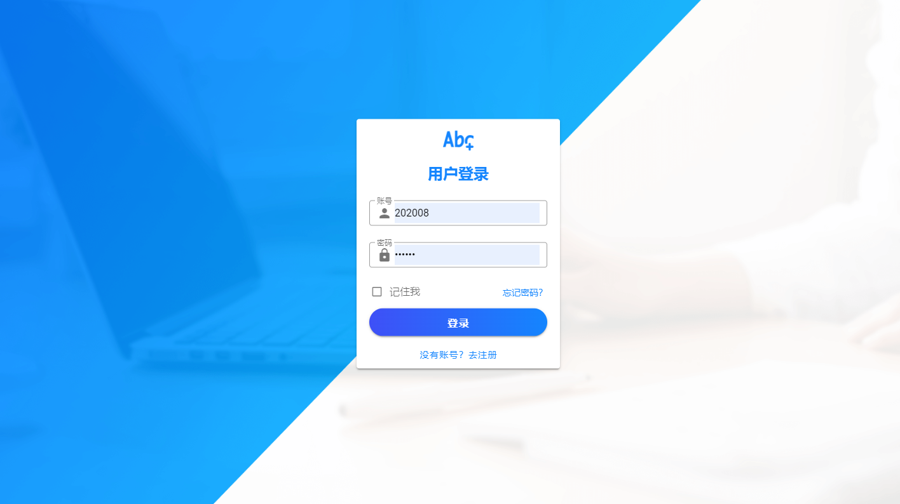
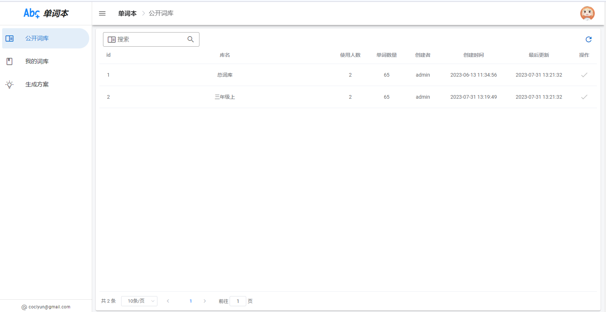
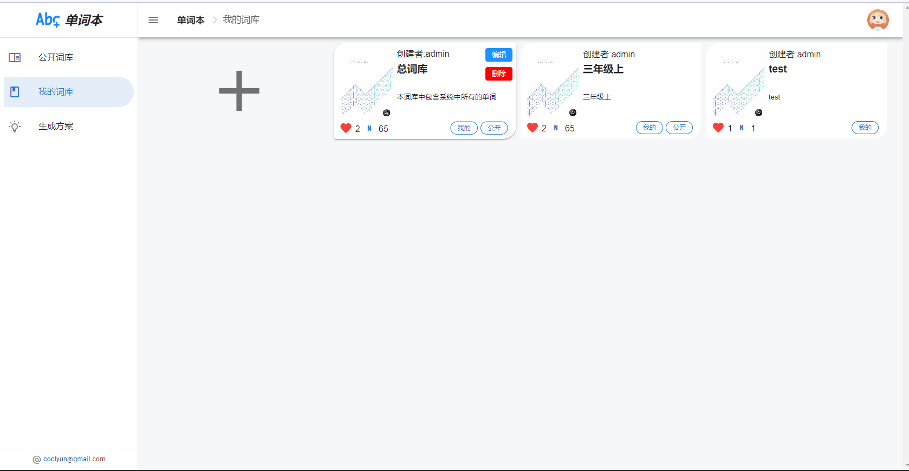
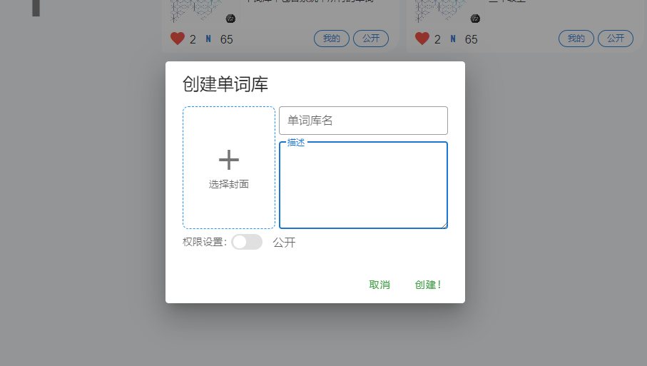
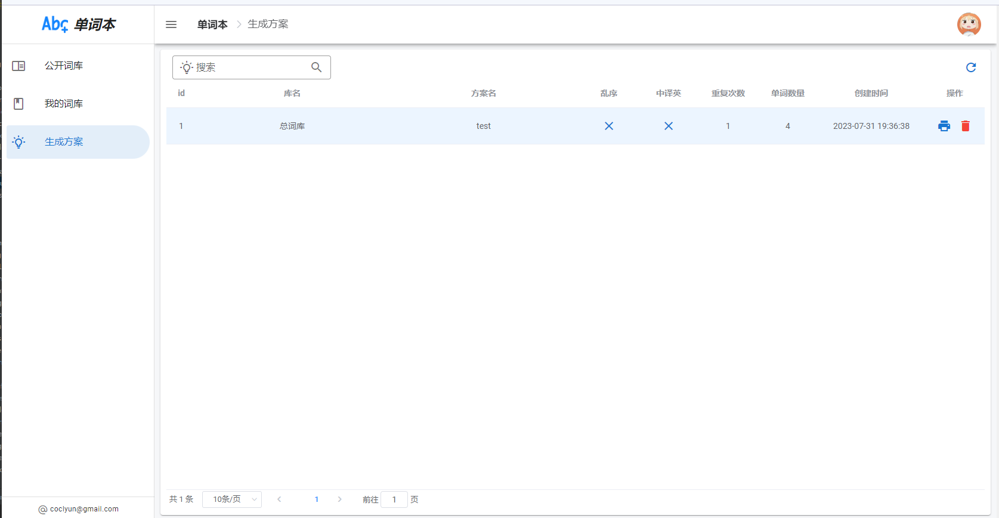
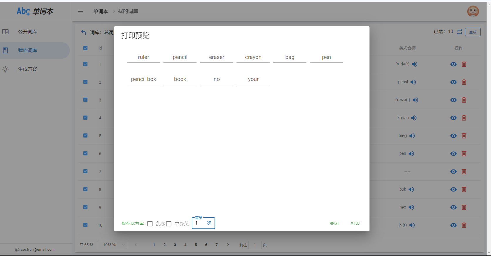
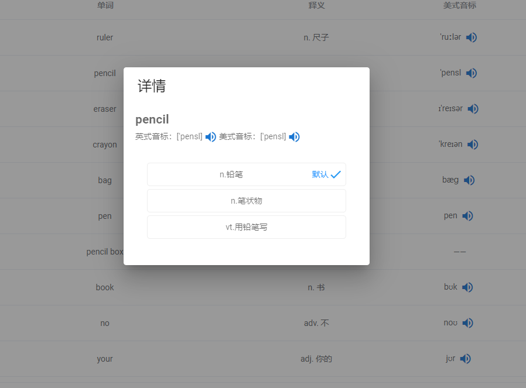

# 1.简介
自用，一个单词学习辅助网站，主要功能就是管理单词，然后可以抽选其中一部分单词出来生成默写格式，有中译英和英译中两种模式。单词的释义由后端自动获取，内置了几个翻译接口，支持扩展配置。

# 2.项目结构

Node 版本：v14.21.3

Vue 2

项目基于前后端分离，但人不分离架构，不是专业的，如果觉得代码风格不适以你为准。

[后端看这](https://gitee.com/coclyun/word-dictation-springboot)，前端基于 Vue2 + [Vuetify2](https://v2.vuetifyjs.com/zh-Hans) + [ElementUI](https://element.eleme.cn/#/zh-CN) + Axios，
同时用了两个UI框架，90%的UI都是使用的[Vuetify2](https://v2.vuetifyjs.com/zh-Hans)，只有在表格等极少数地方用了 [ElementUI](https://element.eleme.cn/#/zh-CN) ，主要是觉得 Element 的表格比较好用。

简单介绍一下项目结构：

## 2.1 components

`components` 中存放的是自定义的组件。

其中`dialog`、`loading`、`snackBar`、`tableLoading`为全局组件，

分别为 `全局弹窗`、`全屏加载条`、`提示条`、`表格加载条`，均基于Vuetify进行二次封装，
我写过 **[一篇博客](https://blog.csdn.net/qq_24683975/article/details/128323040?ops_request_misc=&request_id=2a5b628de8f849faa48f3bc971b7a0a2&biz_id=&utm_medium=distribute.pc_search_result.none-task-blog-2~blog~koosearch~default-1-128323040-null-null.268^v1^control&utm_term=vuetify&spm=1018.2226.3001.4450)**
记录了学习过程。

## 2.2 网络请求

项目中的所有网络请求均放在了 `network` 文件夹下，其中 `request.js` 为请求模板文件。

`details` 文件夹下才是具体的请求，`details` 下我主要是以一个Controller或者一个模块进行命名，然后相关的请求全部放在下面。

当有需要使用的使用，直接`import`对应的js然后像函数一样调用即可，这样比较方便管理接口，不会出现请求在代码中这一块那一块难找的情况，对复用性也很好的支持。

在 `request.js` 对后台接口进行配置，可以同时配置开发路径和部署路径，会根据环境自动切换

## 2.3 打包

在`package.json`中，运行`build:version`命令，将会自动生成版本号（version.js）然后在主界面的左下角会显示版本号。

# 3 界面截图预览

